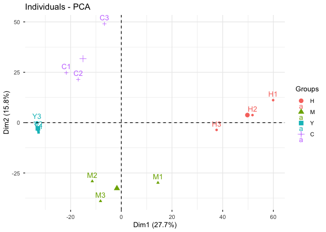

<!-- README.md is generated from README.Rmd. Please edit that file -->

# glyvis <a href="https://glycoverse.github.io/glyvis/"></a>

<!-- badges: start -->

[](https://lifecycle.r-lib.org/articles/stages.html#experimental)
[](https://glycoverse.r-universe.dev/glyvis)
[](https://github.com/glycoverse/glyvis/actions/workflows/R-CMD-check.yaml)
[](https://app.codecov.io/gh/glycoverse/glyvis)
<!-- badges: end -->

The goal of glyvis is to visualize everything in the `glycoverse`
ecosystem. Visualization is an essential part of data analysis. Human
beings are more sensitive to visual information than text and numbers.
Plotting helps us to understand the data better. `glyvis` provides a
unified interface for visualizing `glycoverse` data, including
statistical results, experiments, glycan biosynthesis pathways, and
more. It implements the `autoplot()` method for various `glycoverse`
data structures. Just `autoplot()` it!

## Installation

### Install glycoverse

We recommend installing the meta-package
[glycoverse](https://github.com/glycoverse/glycoverse), which includes
this package and other core glycoverse packages.

### Install glyvis alone

If you don’t want to install all glycoverse packages, you can only
install glyvis.

You can install the latest release of glyvis from
[r-universe](https://glycoverse.r-universe.dev/glyvis)
(**recommended**):

``` r
# install.packages("pak")
pak::repo_add(glycoverse = "https://glycoverse.r-universe.dev")
pak::pkg_install("glyvis")
```

Or from [GitHub](https://github.com/glycoverse/glyvis):

``` r
pak::pkg_install("glycoverse/glyvis@*release")
```

Or install the development version (NOT recommended):

``` r
pak::pkg_install("glycoverse/glyvis")
```

**Note:** Tips and troubleshooting for the meta-package
[glycoverse](https://github.com/glycoverse/glycoverse) are also
applicable here: [Installation of
glycoverse](https://github.com/glycoverse/glycoverse#installation).

## Documentation

-   🚀 Get started:
    [Here](https://glycoverse.github.io/glyvis/articles/glyvis.html)
-   📚 Reference:
    [Here](https://glycoverse.github.io/glyvis/reference/index.html)

## Role in `glycoverse`

The main purpose of `glyvis` is to provide visualization for `glystats`
results. It implements `autoplot()` methods for each result class in
`glystats`, so that the users can visualize the results directly to get
a quick overview. It also provides some other visualization functions
for `glycoverse` data structures, such as `glyexp::experiment()`,
`glyrepr::glycan_structure()`, and others. This package is not intended
to produce publication-quality figures, but to provide a quick
exploration of the data.

## Example

``` r
library(glyexp)
library(glyclean)
#> Warning: 程序包'glyclean'是用R版本4.5.2 来建造的
#> 
#> 载入程序包：'glyclean'
#> The following object is masked from 'package:stats':
#> 
#>     aggregate
library(glystats)
library(glyvis)

exp <- auto_clean(real_experiment)
#> 
#> ── Normalizing data ──
#> 
#> ℹ No QC samples found. Using default normalization method based on experiment type.
#> ℹ Experiment type is "glycoproteomics". Using `normalize_median()`.
#> ✔ Normalization completed.
#> 
#> ── Removing variables with too many missing values ──
#> 
#> ℹ No QC samples found. Using all samples.
#> ℹ Applying preset "discovery"...
#> ℹ Total removed: 24 (0.56%) variables.
#> ✔ Variable removal completed.
#> 
#> ── Imputing missing values ──
#> 
#> ℹ No QC samples found. Using default imputation method based on sample size.
#> ℹ Sample size <= 30, using `impute_sample_min()`.
#> ✔ Imputation completed.
#> 
#> ── Aggregating data ──
#> 
#> ℹ Aggregating to "gfs" level
#> ✔ Aggregation completed.
#> 
#> ── Normalizing data again ──
#> 
#> ℹ No QC samples found. Using default normalization method based on experiment type.
#> ℹ Experiment type is "glycoproteomics". Using `normalize_median()`.
#> ✔ Normalization completed.
#> 
#> ── Correcting batch effects ──
#> 
#> ℹ Batch column  not found in sample_info. Skipping batch correction.
#> ✔ Batch correction completed.

pca_res <- gly_pca(exp)
autoplot(pca_res)
```


