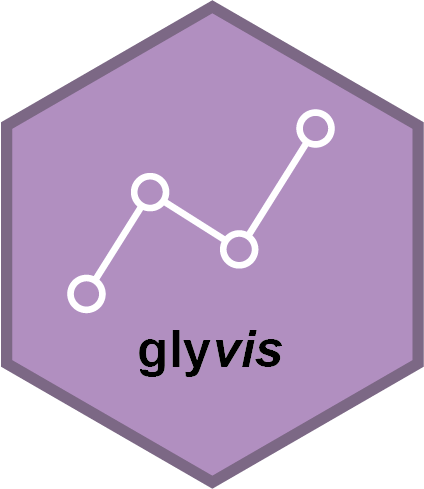

<!-- README.md is generated from README.Rmd. Please edit that file -->

# glyvis <a href="https://glycoverse.github.io/glyvis/"></a>

<!-- badges: start -->

[](https://lifecycle.r-lib.org/articles/stages.html#experimental)
[](https://CRAN.R-project.org/package=glyvis)
[](https://github.com/glycoverse/glyvis/actions/workflows/R-CMD-check.yaml)
[](https://app.codecov.io/gh/glycoverse/glyvis)
<!-- badges: end -->

The goal of glyvis is to visualize everything in the `glycoverse`
ecosystem. Visualization is an essential part of data analysis. Human
beings are more sensitive to visual information than text and numbers.
Plotting helps us to understand the data better. `glyvis` provides a
unified interface for visualizing `glycoverse` data, including
statistical results, experiments, glycan biosynthesis pathways, and
more. It implements the `autoplot()` method for various `glycoverse`
data structures. Just `autoplot()` it!

## Installation

You can install the latest release of glyvis from
[GitHub](https://github.com/) with:

``` r
# install.packages("remotes")
remotes::install_github("glycoverse/glyvis@*release")
```

Or install the development version:

``` r
remotes::install_github("glycoverse/glyvis")
```

## Documentation

-   📚 Reference:
    [Here](https://glycoverse.github.io/glyvis/reference/index.html)

## Role in `glycoverse`

The main purpose of `glyvis` is to provide visualization for `glystats`
results. It implements `autoplot()` methods for each result class in
`glystats`, so that the users can visualize the results directly to get
a quick overview. It also provides some other visualization functions
for `glycoverse` data structures, such as `glyexp::experiment()`,
`glyrepr::glycan_structure()`, and others. This package is not intended
to produce publication-quality figures, but to provide a quick
exploration of the data.

## Example

``` r
library(glyexp)
library(glyclean)
#> 
#> Attaching package: 'glyclean'
#> The following object is masked from 'package:stats':
#> 
#>     aggregate
library(glystats)
library(glyvis)

exp <- auto_clean(real_experiment)
#> ℹ Normalizing data (Median)
#> ✔ Normalizing data (Median) [79ms]
#> 
#> ℹ Removing variables with >50% missing values
#> ✔ Removing variables with >50% missing values [10ms]
#> 
#> ℹ Imputing missing values
#> ℹ Sample size <= 30, using sample minimum imputation
#> ℹ Imputing missing values✔ Imputing missing values [11ms]
#> 
#> ℹ Aggregating data
#> ✔ Aggregating data [376ms]
#> 
#> ℹ Normalizing data again
#> ✔ Normalizing data again [8ms]

pca_res <- gly_pca(exp)
autoplot(pca_res)
```


